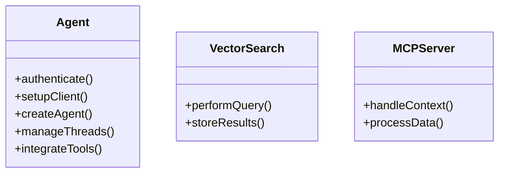

# Snippy Project Wiki

## Project Overview

The "Snippy" project is a sophisticated implementation combining Azure Functions in a Python v2 environment with extensive usage of the Azure AI Agents service. It leverages modern architectural patterns, including blueprint models for function design and vector search integration using Cosmos DB. The project encompasses functionalities for deep wiki generation, code style generation agents, and MCP (Model Context Protocol) server functionality. Comprehensive logging and error handling further ensure robustness.

## Major Concepts

### Azure Functions and Blueprint Model

Azure Functions provide a serverless compute service, allowing developers to run event-driven code without managing servers. This project uses the blueprint model, which is a design pattern promoting organized and reusable function codes. It separates the logical structure of functions into individual, manageable components, improving scalability and maintainability.

### Azure AI Agents Integration

The integration of Azure AI Agents offers powerful workflows designed to enhance interaction capabilities through automation and intelligence, including vector search functionality. Key components involved in Azure AI Agents workflows are:

- **Authentication and Client Setup**: Secure authentication protocols to connect and interact with Azure services.
- **Agent Creation**: Establishing and configuring AI agents for specific task handling and automation.
- **Thread Management**: Optimizing task execution across multiple threads to enhance performance and responsiveness.
- **Tool Integration**: Seamless incorporation of various Azure tools to empower agents with diverse functionalities.

### Vector Search Implementation

Vector search, enabled by Azure AI and Cosmos DB, facilitates the retrieval of relevant data points by organizing them into high-dimensional vectors. This allows efficient querying based on similarity rather than traditional exact-match searches. It is particularly useful for handling and retrieving large datasets with complex relationships.

### Logging and Error Handling

The project employs advanced logging mechanisms to track application flow and diagnose issues, capturing detailed logs, including error messages and stack traces. Error handling is strategically implemented to ensure graceful recovery, minimize disruptions, and provide helpful diagnostics for debugging purposes.

### MCP Server Functionality

Model Context Protocol (MCP) server functionality within the project enables dynamic handling and communication of model contexts, supporting robust interaction and processing of dynamic data environments.

## Mermaid Diagrams

### System Architecture

```mermaid
graph TD
    A[Azure Functions] -->|Invokes| B[Azure AI Agents]
    B -->|Uses| C[Vector Search]
    C -->|Stores| D[Cosmos DB]
    B -->|Integrates| E[Tool Integrations]
    E -->|Enhances| B
    F[Logging and Error Handling] -->|Monitors & Recovers| B
    G[MCP Server] -->|Communicates| A
    title Architecture Diagram
```

### Data Flow

```mermaid
graph LR
    A[Client Request] --> B[Authenticate]
    B --> C[Azure AI Agents]
    C --> D[Data Processing]
    D --> E[Vector Search Results]
    E --> F[Client Response]
    title Data Flow Diagram
```

### Class Hierarchy



## Snippet Catalog

| Snippet ID | Language | Purpose                                         |
|------------|----------|-------------------------------------------------|
| ai-agents-service-usage | Python   | Comprehensive Azure AI Agents workflow implementation |
| vector-search-integration | Python   | Vector search with Azure AI and Cosmos DB   |
| mcp-server-protocol | Python   | MCP server communication handling          |
| error-logging-patterns | Python   | Advanced logging and error recovery strategies |

## Step-by-Step Walkthroughs

### Using Azure AI Agents

1. **Authentication**: Initialize Azure credentials using `DefaultAzureCredential()`
2. **Client Setup**: Configure `AIProjectClient.from_connection_string()` for communication
3. **Agent Creation**: Define agents with specific instructions and tools using `create_agent()`
4. **Thread Management**: Create conversation threads with `create_thread()`
5. **Tool Integration**: Register tools using `AsyncFunctionTool` for agent capabilities
6. **Run Execution**: Monitor agent runs and handle tool calls through status polling

### Vector Search Implementation

1. **Initialize Cosmos DB**: Set up vector-enabled containers for embedding storage
2. **Generate Embeddings**: Use Azure AI Inference to convert text to vectors
3. **Store Vectors**: Save embeddings alongside metadata in Cosmos DB
4. **Perform Queries**: Execute similarity searches using vector distance calculations
5. **Retrieve Results**: Return ranked results with similarity scores

### MCP Server Integration

1. **Protocol Setup**: Initialize MCP server with proper handlers
2. **Tool Registration**: Register available tools and their schemas
3. **Request Processing**: Handle incoming MCP requests and route to appropriate handlers
4. **Response Formatting**: Return results in MCP-compliant format

## Best Practices

### Authentication and Security
- Use `DefaultAzureCredential()` for secure, environment-aware authentication
- Store sensitive configuration in environment variables, never in code
- Implement proper error handling for authentication failures

### Code Organization
- Follow Azure Functions Python v2 blueprint model for modularity
- Use type hints throughout for better code documentation and IDE support
- Implement one-line Google-style docstring summaries for functions

### Logging and Monitoring
- Use structured logging with appropriate levels (INFO for operations, ERROR for failures)
- Include correlation IDs for tracking requests across services
- Log tool call details for debugging agent interactions

### Performance Optimization
- Use async/await patterns consistently for I/O operations
- Implement connection pooling for database operations
- Cache frequently accessed data where appropriate

### Error Handling
- Implement graceful degradation for service failures
- Use context managers for resource cleanup
- Provide meaningful error messages for debugging

## Anti-Patterns

### Code Structure
- **Monolithic Functions**: Avoid large, single-purpose functions; use blueprint model
- **Synchronous Operations**: Don't block on I/O operations; use async patterns
- **Hardcoded Values**: Never embed secrets or configuration in source code

### Error Handling
- **Silent Failures**: Always log and handle exceptions appropriately
- **Generic Exceptions**: Catch specific exception types rather than broad catches
- **Incomplete Cleanup**: Ensure resources are properly disposed of in error scenarios

## Technical Implementation Details

### Azure AI Agents Workflow
```python
# Key pattern for agent interaction
async with DefaultAzureCredential() as credential:
    async with AIProjectClient.from_connection_string(
        credential=credential,
        conn_str=os.environ["PROJECT_CONNECTION_STRING"]
    ) as project_client:
        # Agent creation and execution
        functions = AsyncFunctionTool(functions=[vector_search.vector_search])
        agent = await project_client.agents.create_agent(
            name="Agent",
            instructions=system_prompt,
            tools=functions.definitions,
            model=os.environ["AGENTS_MODEL_DEPLOYMENT_NAME"]
        )
```

### Vector Search Integration
```python
# Vector search query pattern
async def vector_search(query: str, k: int = 30) -> str:
    # Generate embeddings
    embedding_response = await inference_client.embed(
        input=[query],
        model=embedding_model
    )
    # Perform vector search in Cosmos DB
    results = await cosmos_container.query_items(
        query=vector_query,
        parameters=[
            {"name": "@embedding", "value": query_vector},
            {"name": "@k", "value": k}
        ]
    )
```

## Open TODOs

- Enhance agent conversation memory and context management
- Implement more sophisticated vector search algorithms
- Add support for multi-modal embeddings (text, code, images)
- Improve error recovery and retry mechanisms
- Implement comprehensive performance metrics and monitoring
- Add support for agent collaboration and workflow orchestration

## Further Reading

- [Azure Functions Python v2 Programming Model](https://docs.microsoft.com/en-us/azure/azure-functions/functions-reference-python)
- [Azure AI Agents Documentation](https://docs.microsoft.com/en-us/azure/ai-services/agents/)
- [Cosmos DB Vector Search](https://docs.microsoft.com/en-us/azure/cosmos-db/vector-search)
- [Model Context Protocol Specification](https://spec.modelcontextprotocol.io/)
- [Azure AI Inference SDK](https://docs.microsoft.com/en-us/azure/ai-services/inference/)
- [Python Async Best Practices](https://docs.python.org/3/library/asyncio-dev.html)

This comprehensive documentation provides developers with deep insights into the Snippy project's architecture, implementation patterns, and best practices for Azure AI-powered applications.